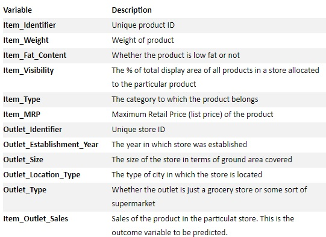

# BigMartSales

Retail is one of the industries that can also take advantage of data analysis to optimize their income among many other processes such as customer service, inventory management, customized offerings and even space allocation.

This notebook presents the analysis of the <a href="https://www.analyticsvidhya.com/">analyticsvidhya</a> dataset containing the sales of different products in 10 outlets in different cities of the One Stop Shopping center and Free Marketplace BigMart. More  info about BigMart <a href="http://www.bigmart.com/about-us.html">here</a>.
 
**Problem Statement**

The data scientists at BigMart have collected 2013 sales data for 1559 products across 10 stores in different cities. Also, certain attributes of each product and store have been defined. The aim is to build a predictive model and find out the sales of each product at a particular store.

Using this model, BigMart will try to understand the properties of products and stores which play a key role in increasing sales.

**Dataset**

The dataset is divided into train (8523 rows) and test (5681 rows) and has the following characteristics:

